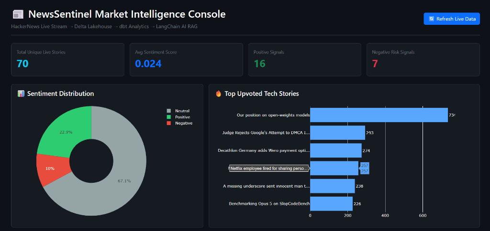
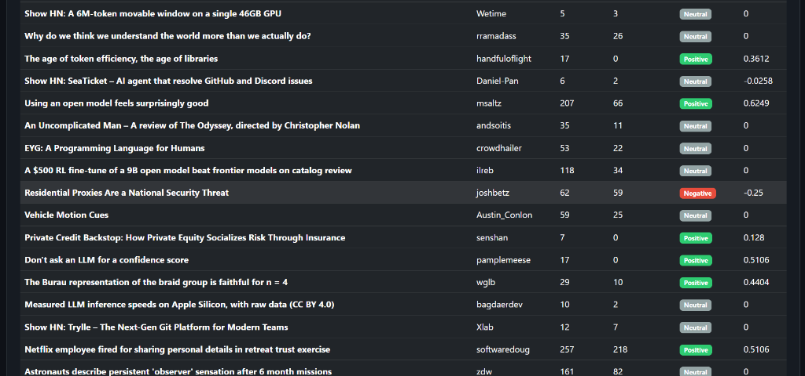

# NewsSentinel: Real-Time Market & Tech Trend Intelligence Platform

NewsSentinel is an enterprise-grade real-time streaming data platform that ingests live tech stories from HackerNews, stores them in a local Delta Lakehouse, cleans and transforms them using dbt, analyzes sentiment with VADER NLP, and provides natural-language market intelligence through a LangChain AI RAG Agent served over a FastAPI web application.

## System Architecture

```
[HackerNews Live API] -> [Kafka (Docker)] -> [Delta Lake] -> [dbt + DuckDB] -> [VADER NLP & LangChain] -> [FastAPI Console]
```

---

## Dashboard Preview & Features





- **Executive KPI Metrics**: Live count of total unique stories, average sentiment compound score, positive market signals, and negative risk indicators.
- **Interactive Visual Analytics**:
  - **Sentiment Distribution Donut Chart**: Breakdown of market sentiment proportions (Positive / Neutral / Negative).
  - **Top Upvoted Tech Stories Bar Chart**: Ranking of top-trending tech stories by community engagement score.
- **LangChain AI Market Assistant**: Conversational agent answering ad-hoc queries like *"Show top positive tech news"* or *"Any negative risk stories?"*.
- **Real-Time News Feed Table**: Searchable, deduplicated live news feed table displaying authors, upvotes, comment counts, and VADER sentiment classification badges.

---

## Step-by-Step Setup Guide

### 1. Prerequisites
- Python 3.11+
- Docker Desktop

### 2. Environment Setup
Clone or navigate to the project directory:
```bash
cd C:\Users\HP\.gemini\antigravity\scratch\newssentinel
```

Create and activate virtual environment:
```bash
python -m venv venv

# Windows PowerShell / CMD:
.\venv\Scripts\activate

# Mac / Linux:
source venv/bin/activate
```

Install dependencies:
```bash
pip install -r requirements.txt
```

Set up environment file:
```bash
cp .env.example .env
```
*(Optional: Add your free Google Gemini API key to `.env` if available)*

### 3. Start Local Kafka Broker
```bash
docker compose up -d
```

### 4. Run Live Data Ingestion
Open **Terminal 1**:
```bash
python src/hackernews_producer.py
```

Open **Terminal 2**:
```bash
python src/lakehouse_consumer.py
```

### 5. Run dbt Transformations & Data Quality Tests
Open **Terminal 3**:
```bash
cd dbt_project
dbt run --profiles-dir .
dbt test --profiles-dir .
cd ..
```

### 6. Launch FastAPI Console & Swagger Docs
Open **Terminal 4**:
```bash
python src/main.py
```
Open your browser at:
- **Analyst Web Console**: `http://127.0.0.1:8000`
- **Interactive OpenAPI Specs**: `http://127.0.0.1:8000/docs`
